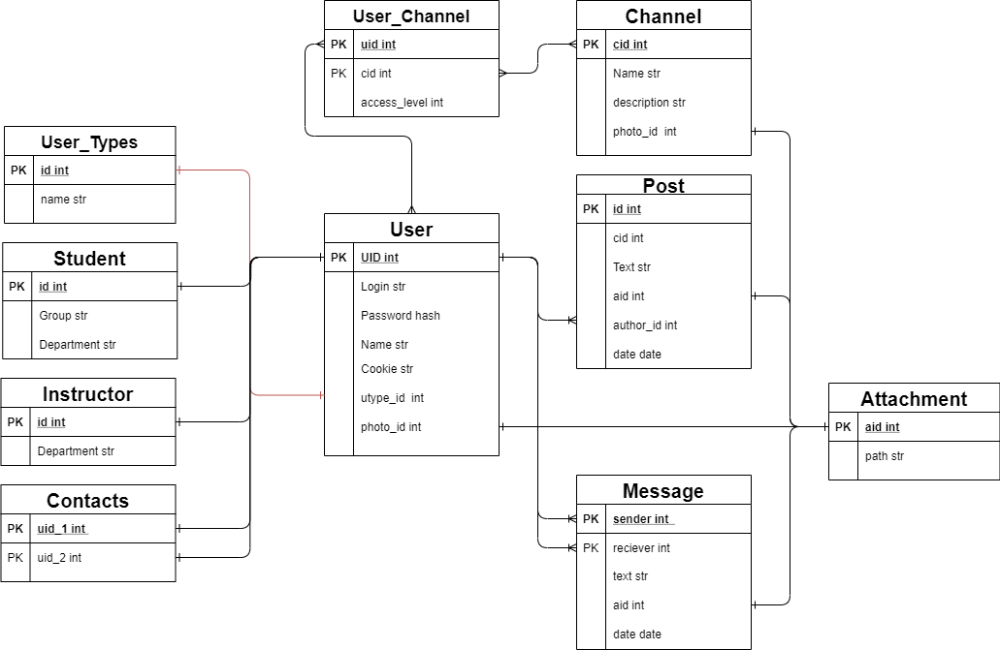

<h1 align="center">Соціальна мережа студентів та викладачів КПІ</h1>
<h2 align="center">

</h2>

  

  

  

  

##### Зміст
[Опис](#опис)  
[API](#api)  
[Тестування API](#тестування-api)

[База даних](#база-даних)

# Опис

**Наші цілі**

Соціальна мережа студентів та викладачів КПІ створена задля того, аби забезпечити якісну комунікацію студентів та викладачів КПІ у
мережі інтернет та покращити якість та ефективність дистанційного навчання в КПІ.

**Чому проект має бути**

Створення даної мережі вирішує одразу декілька проблем, та сприяє розвиту університету!

А саме:
- Бажання студентів та викладачів мати якісний рівень комунікаціїї
між собою в деякому окремому, стабільному та комфортному середовищі.
- Запровадженння дистанційної форми навчання в університеті.
- Відсутність діючої загальної стабільної та комфортної системи
комунікації між студентами та викладачами.
- Наявність схожих конкуруючих систем в інших університетах.
- Наявність всесвітньої практики створення окремої платформи для
комунікації між студентами та викладачами. 

**Як використовувати соціальну мережу**

- Реєстрація користувача. Користувач повинен зареєструватися в
системі, щоб мати доступ до функції соціальної мережі та задати
потрібні дані: нікнейм, пароль, електронна пошта, ім’я, факультет,
кафедра, статус (викладач або студент), група (для студентів).
- Вхід до системи. Зареєстрованний користувач має війти до системи
після реєстрації або на іншому девайсі.
- Зміна даних профілю. Користувач може змінювати персональні данні
під час реєстрації та після неї.
- Відправка повідомлення. Користувач може відправляти особисті
повідомлення іншому користувачу, а також пости в канал, до якого
він має доступ.
- Приєднання до каналу. Користувач може приєднатися до каналу по
спеціальному посиланні або за запрошенням іншого користувача.
- Створення каналу. Користувач може створювати власні канали, до
яких може запрошувати інших користувачів.
- Коментування поста. Користувач має змогу користувати
пости в каналі, до якого він має доступ.

**Якими засобами було розроблено проект**

- Для розробки серверної частини використовувати мову
програмування Python, бібліотеку Flask;
- Для розробки клієнтської частини використовувати мову
програмування JavaScript (TypeScript), бібліотеки ReactJS, Redux
Toolkit, Ant Design;
- Для реалізації live-чату використовувати технології websocket;
- Забезпечено доступ до мережі для не менш ніж 30 000 користувачів.
# API

## /api/session

Методи: GET, POST, DELETE

**GET**

*Перевіряє чи авторизований користувач.*

Return: `{'data': {'id': int(cookies['uid'])}, 'errors': []}`

**POST**

*Авторизувати користувача та встановлює cookie*

Expected JSON request: `{
				‘login’: …,
				‘password: …
			}`

Return: `{'data': {'id': user.uid}, 'errors': []}`

**DELETE**

*Вийти з аккаунту користувача*

Return: `{'data': {}}, 'errors': []}`

## /api/user/<int:uid>

Методи: GET, POST, PUT, DELETE

Uid - id користувача (integer)

**GET**

*Перевіряє чи авторизований користувач.*

Return: `{'data': 
{'id': user.uid, 
'login': user.login,
'name': user.name,
'status': user.utype.name,
'photo': user.photo.path}, 'errors': []}`

А також в залежності від user.utype.id повератає *department* та *group*

**POST**

*Створити нового користувача та встановити cookie*

Expected JSON request: `{
				‘login’: …,
				‘password: …, 
				‘Name’: …,
				‘Status’: ...
			}`

Return: `{'data': {'id': new_user.uid}, 'errors': []}`

**DELETE**

*Видалити користувача*

Return: `{'data': {}}, 'errors': []}`

**PUT**

*Оновити інформацію про користувача*

Return: `{'data': {}}, 'errors': []}`

## /api/user/channels

Методи: GET

**GET**

*Отримати канали, на які підписаний користувач*

Return: `{'data': {'items': items, 'total': len(items)}, 'errors': []}`

## /api/channel/<int:cid>

Методи: GET, PUT,POST, DELETE

сid - id каналу (integer)

**GET**

*Отримати інформацію про канал*

Return: `{'data': 
{'id': channel.cid, 
'name': channel.name,
'description': channel.description,
'photo': channel.photo.path}, 'errors': []}`

**POST**

*Створити новий канал*

Return: `{'data': {'id': new_channel.cid}, 'errors': []}`

**DELETE**

*Видалити користувача*

Return: `{'data': {}}, 'errors': []}`

**PUT**

*Оновити інформацію про канал*

Return: `{'data': {}}, 'errors': []}`

## /api/channel/<int:cid>/members

Методи: GET

cid - id каналу

**GET**

*Отримати список учасників каналу*

Return: `{'data': {'items': items, 'total': len(items)}}, 'errors': []}`

## /api/channel/<int:cid>/posts

Методи: GET

cid - id каналу

**GET**

*Отримати список постів даного каналу*

Return: `{'data': {'items': items, 'total': len(items)}}, 'errors': []}`

## /api/posts/<int:pid>

Методи: GET, PUT,POST, DELETE

pid - id посту

**GET**

*Отримати інформацію про пост*

Return: `{'data': data}, 'errors': []}`

**POST**

*Створити новий канал*

Expected JSON request: `{
				‘cid’: …
			}`

Return: `{'data': {'id': new_post.id}, 'errors': []}`

## /api/uploads/<filename>

Методи: GET

**GET**

*Доступ до статичного файлу filename*

Return *файл з папкою static*

## /api/search?query=...&page=...&count=...
Методи: GET

Page - номер сторінки (частини масиву)

Count - кількість елементів на сторінці

**GET**

*Пошук користувача по логіну або імені*

Return: `{'data': {'items': items, 'total': total}, 'errors': []}`

## /api/user/contacts?page=...&count=...
Методи: GET

**GET**

*Отримати контакти користувача*

Return: `{'data': {'items': items, 'total': comtacts_count}, 'errors': []}`

## /api/contact/<int:contact_id>
contact_id - ID контакту

Методи: POST, DELETE

**POST**

*Додати новий контакт*

Return: `{'data': {}, 'errors': []}`

**DELETE**

*Видалити контакт*

Return: `{'data': {}, 'errors': []}`

## /api/direct/<int:partner>?page=...&count=...
partner - ID партнера, з яким веде переписку поточний користувач

Методи: GET

**GET**

*Отримати дані переписки (повідомлення) між поточним користувачем та partner'ом*

Return: `{'data': {'items': items, 'total': message_count}, 'errors': []}`

## /api/message
Методи: POST
**POST**

*Надіслати повідомлення*

Expected JSON request: `{
				‘receiverId’: …,
				‘text: …
			}`

Return: `{'data': {'id': new_message.id}, 'errors': []}`

# Тестування API

**Опис**: тестування відбувається за використанням фреймворку pytest у файлі test_flask.py. Ми створюємо тестовий клієнт Flask'у, за допомогою якого відправляємо певний запит на сервер. Після отримання даних від серверу, ми перевіряємо оператором assert відповідність очікуваних та отриманих даних. Тести запускаються за допомогою команди pytest -v у папці з test_flaskr.py

## test_login(client)
Ендпоїнт, що перевіряється: /api/session

Метод, що перевіряється: POST

Тест №1:

- Опис:*перевірка коректності авторизації користувача*

- Дані для відправки: `{'login': 'NancyDye8533', 'password': 'NancyDye8533'}`

- Очікувані дані: `{'data': {'id': ...}, 'errors': []}`

Тест №2:

- Опис: *перевірка чи не буде сервер авторизовувати користувача з некоректними даними*

- Дані для відправки: `{'login': 'invalid login', 'password': 'NancyDye8533'}`

- Очікувані дані: `{'data': {},'errors': ['Invalid login or password']}`

## test_get_session(client)
Ендпоїнт, що перевіряється: /api/session

Метод, що перевіряється: GET

Для коректної роботи спочатку авторизовуємо користувача: `client.post('/api/session',  json={'login': 'NancyDye8533', 'password': 'NancyDye8533'})`

- Опис:*перевірка чи коректно записується користувачу coockie*

- Очікувані дані: `{'data': {'id': ...}, 'errors': []}`

## test_logout(client)
Ендпоїнт, що перевіряється: /api/session

Метод, що перевіряється: DELETE

Для коректної роботи спочатку авторизовуємо користувача: `client.post('/api/session',  json={'login': 'NancyDye8533', 'password': 'NancyDye8533'})`

- Опис:*перевірка коректності виходу з аккаунту користувача*

- Додатково перевіряємо, що coockie користувача дійсно видалені з сессії за допомогою `json.loads(client.get('/api/session').data)`

- Очікувані дані: `{'data': {},'errors': ['No cookies']}`

## test_get_user(client)
Ендпоїнт, що перевіряється: /api/user/<int:uid>

uid = 1
Метод, що перевіряється: GET

- Опис:*перевірка чи повертає сервер дані про користувача*

- Очікувані дані: `{'data': {'id': ...},'errors': []}`

## test_create_user(client)
Ендпоїнт, що перевіряється: /api/user

Метод, що перевіряється: POST

Тест №1:

- Опис:*перевірка чи коректно сервер створює користувача*

- Дані для відправки: `{'login': 'logex', 'password': 'passex', 'name': "nameex", 'status': 'student'}`

- Очікувані дані: `{'data': {'id': ...}, 'errors': []}`

Тест №2:

- Опис: *перевірка чи не буде сервер створювати користувача з некоректними даними*

- Дані для відправки: `{'login': 'logex', 'password': 'passex', 'name': "nameex", 'status': 'notstudent'}`

- Очікувані дані: `{'data': {},'errors': ['Unknown user type']}`
Тест №3:

- Опис: *перевірка чи не буде сервер створювати користувача з некоректними даними*

- Дані для відправки: `{'login': 'logex', 'password': 'passex', 'name': "nameex"}`

- Очікувані дані: `{'data': {},'errors': ['Bad request.']}`

## test_edit_user(client)
Ендпоїнт, що перевіряється: /api/user

Метод, що перевіряється: PUT

Для коректної роботи спочатку авторизовуємо користувача: `client.post('/api/session',  json={'login': 'NancyDye8533', 'password': 'NancyDye8533'})`

Тест №1
- Опис:*первірка коректності поведінки серверу на запит про редагування юзера*

- Дані для відправки: `{'name': "nameex", 'department': "departmentex", 'group': "groupex"}`

- Очікувані дані: `{'data': {},'errors': []}`

Тест №2:

- Опис: *перевірка що name користувача дійсно було змінено*

- Дані для відправки: `{'name': "nameex", 'department': "departmentex", 'group': "groupex"}`

- Очікувані дані: `{'data': {'name': "nameex", ...},'errors': []}`

## test_get_user_channels(client)
Ендпоїнт, що перевіряється: /api/user/channels

Метод, що перевіряється: GET

Для коректної роботи спочатку авторизовуємо користувача: `client.post('/api/session',  json={'login': 'NancyDye8533', 'password': 'NancyDye8533'})`

- Опис:*перевірка що сервер відправляє канали, в яких є користувач*

- Очікувані дані: `{'data': {'items': items, ...},'errors': []}`

## test_get_channel(client)
Ендпоїнт, що перевіряється: /api/channel/<int:cid>

cid = 9
Метод, що перевіряється: GET

Тест №1:

- Опис:*перевірка чи повертає сервер коретну інформацію про канал*

- Очікувані дані: `{'data': {'id': 1, ...}, 'errors': []}`

Тест №2:

- Опис: *перевірка коректності поведінки серверу при запиті неіснуючого каналу*

- Очікувані дані: `{'data': {},'errors': ['Channel not found']}`

## test_create_channel(client)
Ендпоїнт, що перевіряється: /api/channel

Метод, що перевіряється: POST

Для коректної роботи спочатку авторизовуємо користувача: `client.post('/api/session',  json={'login': 'NancyDye8533', 'password': 'NancyDye8533'})`

- Опис:*перевірка чи коректно сервер створює канал*

- Дані для відправки: `{'name': 'nameex', 'description': 'descex', 'members': [2, 3]}`

- Очікувані дані: `{'data': {'id': ..., ...}, 'errors': []}`

## test_edit_channel(client)
Ендпоїнт, що перевіряється: /api/channel/<int:cid>

cid = 9
Метод, що перевіряється: PUT

Для коректної роботи спочатку авторизовуємо користувача: `client.post('/api/session',  json={'login': 'NancyDye8533', 'password': 'NancyDye8533'})`

Тест №1
- Опис:*первірка коректності поведінки серверу на запит про зміну каналу*

- Дані для відправки: `{'name': 'nameex'}`

- Очікувані дані: `{'data': {},'errors': []}`

Тест №2:

- Опис: *первірка коректності поведінки серверу на запит про зміну неіснуючого каналу, для цього передаємо в якості id каналу 999999*

- Дані для відправки: `{'name': 'nameex'}`

- Очікувані дані: `{'data': {},'errors': ['Channel not found']}`

## test_get_channel_posts(client)
Ендпоїнт, що перевіряється: /api/channel/<int:cid>/posts

cid = 9
Метод, що перевіряється: GET

- Опис:*перевірка чи повертає сервер коретну інформацію про канал*

- Очікувані дані: `{'data': {'items': ..., ...},'errors': []}`

## test_get_post(client)
Ендпоїнт, що перевіряється: /api/posts/<int:pid>

pid = 1
Метод, що перевіряється: GET

Тест №1
- Опис:*перевірка чи повертає сервер коретну інформацію про пост*

- Очікувані дані: `{'data': {'id': ...},'errors': []}`

Тест №2:

- Опис: *перевірка коректності поведінки серверу при запиті неіснуючого посту, для цього передаємо в якості id поста 999999*

- Очікувані дані: `{'data': {},'errors': ['Post not found']}`

## test_create_post(client)
Ендпоїнт, що перевіряється: /api/posts

Метод, що перевіряється: POST

Тест №1
- Опис:*перевірка чи коректно сервер створює пост*

- Дані для відправки: `{'text': 'textex', 'channelId': 1}`

- Очікувані дані: `{'data': {'id': ...},'errors': []}`

Тест №2:

- Опис: *перевірка чи не створює сервер пост з неіснуючим каналом*

- Дані для відправки: `{'text': 'textex', 'channelId': 999999}`

- Очікувані дані: `{'data': {},'errors': ['Specified channel does not exist']}`

## test_get_search(client)
Ендпоїнт, що перевіряється: /api/search

Метод, що перевіряється: GET

Для коректної роботи спочатку авторизовуємо користувача: `client.post('/api/session',  json={'login': 'NancyDye8533', 'password': 'NancyDye8533'})`

- Опис:*перевіряє чи коректно сервер виконує пошук по користувачам, для цього передаємо запит query=Esther, щоб сервер повернув користовачів, чиє ім`я починаеться на 'Esther'*

- Очікувані дані: `{'data': {'items': ..., ...},'errors': []}`

## test_get_user_contacts(client)
Ендпоїнт, що перевіряється: /api/user/contacts

Метод, що перевіряється: GET

Для коректної роботи спочатку авторизовуємо користувача: `client.post('/api/session',  json={'login': 'NancyDye8533', 'password': 'NancyDye8533'})`

- Опис:*перевіряє чи коректно сервер отримує контакти користувача*

- Очікувані дані: `{'data': {'items': ..., ...},'errors': []}`

## test_add_contact(client)
Ендпоїнт, що перевіряється: /api/contact/<int:contact_id>

contact_id = 2
Метод, що перевіряється: POST

Для коректної роботи спочатку авторизовуємо користувача: `client.post('/api/session',  json={'login': 'NancyDye8533', 'password': 'NancyDye8533'})`

- Опис:*перевіряє чи коректно сервер додає контакт до поточного користувача*

- Очікувані дані: `{'data': {},'errors': []}`

## test_get_direct_massages(client)
Ендпоїнт, що перевіряється: /api/direct/<int:partner>

partner = 36
Метод, що перевіряється: GET

Для коректної роботи спочатку авторизовуємо користувача: `client.post('/api/session',  json={'login': 'NancyDye8533', 'password': 'NancyDye8533'})`

- Опис:*перевіряє чи коректно сервер отримує дані переписки (повідомлення) між поточним користувачем та partner'ом*

- Очікувані дані: `{'data': {'items': ..., ...},'errors': []}`

## test_create_massage(client)
Ендпоїнт, що перевіряється: /api/message

Метод, що перевіряється: POST

Для коректної роботи спочатку авторизовуємо користувача: `client.post('/api/session',  json={'login': 'NancyDye8533', 'password': 'NancyDye8533'})`

- Опис:*перевіряє чи коректно надсилає повідомлення*

- Дані для відправки: `{'receiverId': 2, 'text': 'halo'}`

- Очікувані дані: `{'data': {'id': ...},'errors': []}`

# Результати тестування API

# База даних
*База даних: PostgeSQL*

*ORM: SQLALCHEMY*

